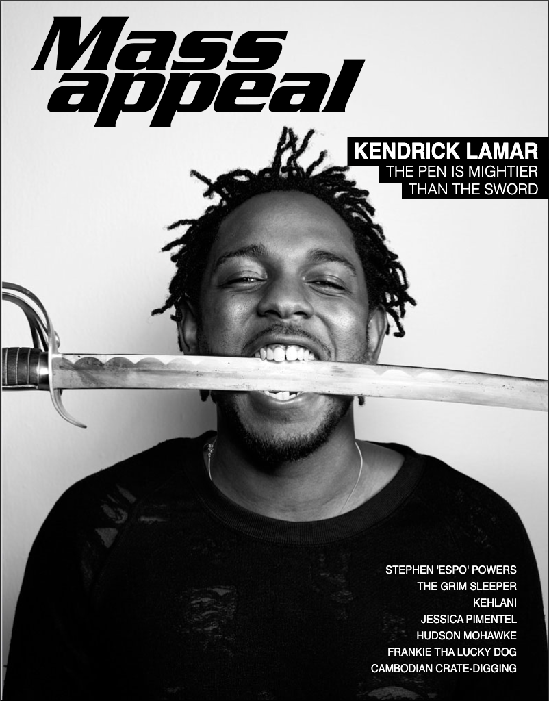
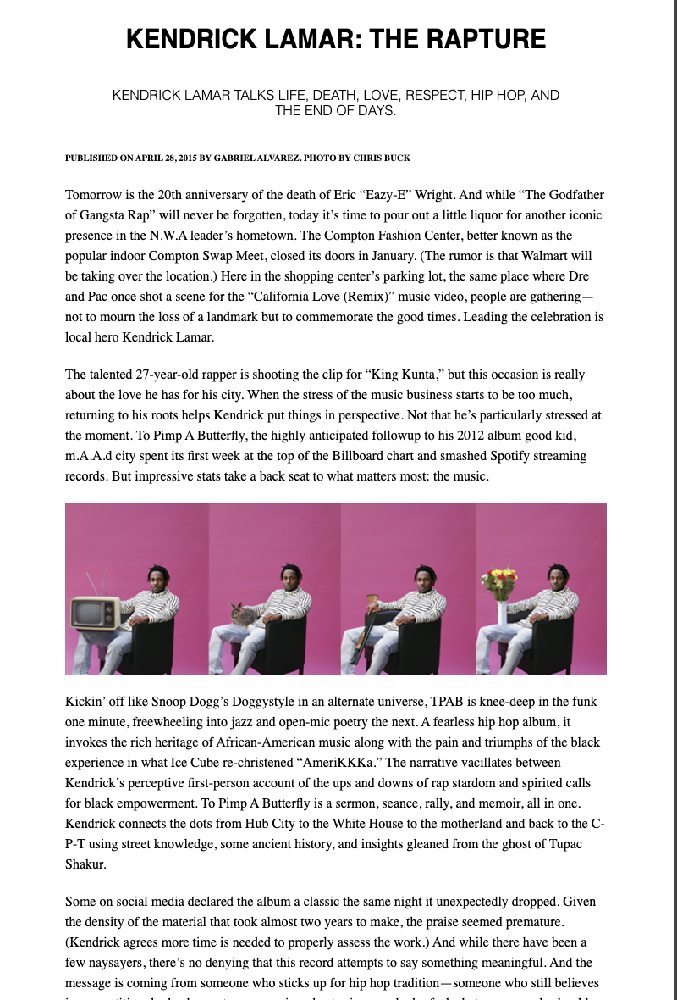

# Lab 02 – HTML/CSS Magazine Design




---

## Background

Print magazines have been laying out text and images on a page for over a century. When the web arrived, designers had to learn how to recreate that same visual precision using HTML and CSS. Today, tools like absolute positioning, custom fonts, CSS transforms, and pseudo-elements give us the power to build magazine-quality layouts entirely in the browser — no Photoshop required.

In this lab you will recreate a two-section magazine page: a styled **cover** and a formatted **article**. You will practice writing semantic HTML, loading custom web fonts, positioning elements precisely with CSS, and using `::before` pseudo-elements to create decorative design effects.

---

## Objectives

By the end of this lab you will be able to:

- Structure an HTML page using semantic heading levels (`h1`–`h6`) and paragraphs
- Use `<br>` tags to control inline line breaks
- Embed images with descriptive `alt` text
- Create hyperlinks that open in a new tab using `target="_blank"`
- Load custom typefaces using `@font-face`
- Apply `position: absolute` to place elements precisely on a page
- Use CSS transforms (`skewX`, `scaleX`) to style text
- Use the `::before` pseudo-element to add decorative backgrounds without extra HTML
- Apply `background-image` with `background-size: cover` to a container
- Use `nth-child()` selectors to target specific sibling elements

---

## Instructions

### Part 1 — HTML Content

Open `index.html`. You will see 15 numbered comment placeholders inside two `<div>` sections: `#magazine-cover` and `#magazine-article`. Replace each comment with the correct HTML element.

> **Do not remove the comment** — replace it with the actual element immediately after it, or swap the comment for the element. Keep the structure of the surrounding `<div>` containers intact.

---

#### Magazine Cover (`#magazine-cover`)

**1. `<h1>` — "Mass"**
Add a level 1 heading with the text `Mass`.

**2. `<h1>` — "appeal"**
Add a second level 1 heading with the text `appeal`, directly after the first.

**3. `<h2>` — "KENDRICK LAMAR"**
Add a level 2 heading with the text `KENDRICK LAMAR`.

**4. `<h3>` — "THE PEN IS MIGHTIER"**
Add a level 3 heading with the text `THE PEN IS MIGHTIER`.

**5. `<h3>` — "THAN THE SWORD"**
Add a level 3 heading with the text `THAN THE SWORD`.

**6. `<p>` — Contributor names**
Add a paragraph containing the following names, with a `<br>` tag after each one (except the last):

```
STEPHEN 'ESPO' POWERS
THE GRIM SLEEPER
KEHLANI
JESSICA PIMENTEL
HUDSON MOHAWKE
FRANKIE THA LUCKY DOG
CAMBODIAN CRATE-DIGGING
```

---

#### Magazine Article (`#magazine-article`)

**7. `<h2>` — Article title**
Add a level 2 heading with the text `KENDRICK LAMAR: THE RAPTURE`.

**8. `<h3>` — Article subtitle**
Add a level 3 heading with the text:
`KENDRICK LAMAR TALKS LIFE, DEATH, LOVE, RESPECT, HIP HOP, AND THE END OF DAYS.`

**9. `<p>` with `<h6>` inside — Byline**
Add a paragraph. Inside it, nest an `<h6>` element with the text:
`PUBLISHED ON APRIL 28, 2015 BY GABRIEL ALVAREZ. PHOTO BY CHRIS BUCK`

**10. `<p>` — First body paragraph**
Add a paragraph with the following text:

> Tomorrow is the 20th anniversary of the death of Eric "Eazy-E" Wright. And while "The Godfather of Gangsta Rap" will never be forgotten, today it's time to pour out a little liquor for another iconic presence in the N.W.A leader's hometown. The Compton Fashion Center, better known as the popular indoor Compton Swap Meet, closed its doors in January. (The rumor is that Walmart will be taking over the location.) Here in the shopping center's parking lot, the same place where Dre and Pac once shot a scene for the "California Love (Remix)" music video, people are gathering—not to mourn the loss of a landmark but to commemorate the good times. Leading the celebration is local hero Kendrick Lamar.

**11. `<p>` — Second body paragraph**
Add a paragraph with the following text:

> The talented 27-year-old rapper is shooting the clip for "King Kunta," but this occasion is really about the love he has for his city. When the stress of the music business starts to be too much, returning to his roots helps Kendrick put things in perspective. Not that he's particularly stressed at the moment. To Pimp A Butterfly, the highly anticipated followup to his 2012 album good kid, m.A.A.d city spent its first week at the top of the Billboard chart and smashed Spotify streaming records. But impressive stats take a back seat to what matters most: the music.

**12. `` — Article photo**
Add an image using these attributes:

```
src="https://raw.githubusercontent.com/hhassan1230/lab-01-html-magazine-cover-start/master/images/kendrick-lamar-pink-series.jpg"
alt="Photo of Kendrick Lamar by Chris Buck"
```

**13. `<p>` — Third body paragraph**
Add a paragraph with the following text:

> Kickin' off like Snoop Dogg's Doggystyle in an alternate universe, TPAB is knee-deep in the funk one minute, freewheeling into jazz and open-mic poetry the next. A fearless hip hop album, it invokes the rich heritage of African-American music along with the pain and triumphs of the black experience in what Ice Cube re-christened "AmeriKKKa." The narrative vacillates between Kendrick's perceptive first-person account of the ups and downs of rap stardom and spirited calls for black empowerment. To Pimp A Butterfly is a sermon, seance, rally, and memoir, all in one. Kendrick connects the dots from Hub City to the White House to the motherland and back to the C-P-T using street knowledge, some ancient history, and insights gleaned from the ghost of Tupac Shakur.

**14. & 15. `<p>` with `<a>` inside — Final paragraph + link**
Add a paragraph with the text below. At the end of the paragraph, include an anchor link:

> Some on social media declared the album a classic the same night it unexpectedly dropped. Given the density of the material that took almost two years to make, the praise seemed premature. (Kendrick agrees more time is needed to properly assess the work.) And while there have been a few naysayers, there's no denying that this record attempts to say something meaningful. And the message is coming from someone who sticks up for hip hop tradition—someone who still believes in competition, looks down at rappers using ghostwriters, and who feels that more people should listen to Killer Mike.

Link:

- Text: `Read More of the full article here.`
- `href`: `http://massappeal.com/mass-appeal-issue-56-cover-story-kendrick-lamar/`
- Opens in a new tab (`target="_blank"`)

---

### Part 2 — CSS Styling

Open `style.css`. The `@font-face` rules and base image/box-sizing styles are already provided. Your job is to fill in the empty rule blocks. Use the reference image and the hints in the comments to guide your work.

> **Tip:** Open your `index.html` in a browser as you work and refresh after each change. Use Chrome DevTools (right-click → Inspect) to experiment with values before writing them in the file.

---

#### Layout & Container

```css
body {
  margin: 0;
  background: #444;
}

.container {
  width: 800px;
  margin: 2% auto;
}
```

---

#### Magazine Cover

**Cover wrapper** — give it a background image, fixed height, a border, and box-shadow:

```css
#magazine-cover {
  background: url(https://raw.githubusercontent.com/hhassan1230/lab-01-html-magazine-cover-start/master/images/cover-photo-background.jpg)
    no-repeat center;
  background-size: cover;
  height: 1023px;
  border: 1px solid black;
  box-shadow: 0 2px 4px black;
  position: relative;
  margin-bottom: 0;
}
```

**Cover headings/paragraph** — use `position: absolute` so you can place each one precisely. Set `line-height: 0`, `margin: 0`, and `z-index: 10`:

```css
#magazine-cover h1,
#magazine-cover h2,
#magazine-cover h3,
#magazine-cover p {
  position: absolute;
  line-height: 0;
  margin: 0;
  z-index: 10;
}
```

**`h1`** — use the `Serpentine` font, `font-size: 7.5em`, black text, and apply a horizontal skew:

```css
transform: skewX(-10deg);
```

**`h2` and `h3`** — use the `OsakaMono` font family.

**`h2`** — uppercase, `font-size: 2em`, and slightly compress the width using `transform: scaleX(0.92)`.

**`h3`** — uppercase, `font-weight: lighter`, `font-size: 1.35em`.

**Positioning each cover element** — use `top`, `left`, and `right` with pixel values to place each element. Use DevTools to experiment:

| Selector                          | Approx. position                                     |
| --------------------------------- | ---------------------------------------------------- |
| `#magazine-cover h1:nth-child(1)` | `top: 72px; left: 45px;`                             |
| `#magazine-cover h1:nth-child(2)` | `top: 134px; left: 64px;`                            |
| `#magazine-cover h2`              | `top: 219px; left: 503px;` white text                |
| `#magazine-cover h3:nth-child(4)` | `top: 249px; left: 562px;` white text                |
| `#magazine-cover h3:nth-child(5)` | `top: 275px; left: 595px;` white text                |
| `#magazine-cover p`               | `top: 819px; right: 37px;` white text, right-aligned |

**`::before` pseudo-elements** — the black rectangular bars behind the cover `h2` and `h3` headings are created with `::before`. Each one uses `content: ' '`, `display: block`, `position: absolute`, `background: black`, and `z-index: -1`. Adjust `width`, `height`, `top`, and `left` values to fit snugly behind the text.

Example structure:

```css
#magazine-cover h2::before {
  content: " ";
  display: block;
  width: 320px;
  height: 42px;
  position: absolute;
  background: black;
  z-index: -1;
  top: -21px;
  left: -10px;
}
```

Apply the same pattern to `h3:nth-child(4)::before` and `h3:nth-child(5)::before`, adjusting the dimensions to fit each heading.

---

#### Magazine Article

```css
#magazine-article {
  background: white;
  padding: 80px;
}
```

Style the article `h2`, `h3`, and `p` elements for clean, readable typography:

- `h2`: centered, `color: black`, small margin
- `h3`: centered, `color: black`, `font-size: 1em`, larger margin
- `p`: use `font: normal 1em/1.5em Times, serif` and `margin-bottom: 20px`

---

### Part 3 — Reflection

Create a file called `reflection.md` in your repo and answer the following questions in your own words (2–4 sentences each):

1. What is `position: absolute` and why is it useful for a layout like this magazine cover? What would happen if you removed it?
2. What does the `::before` pseudo-element do, and why is it useful to add decorative elements this way instead of adding extra HTML tags?
3. What challenges did you face when trying to position elements on the cover? How did you use the browser's DevTools to help?

---

### Part 4 — Submit via Pull Request

1. Fork this repository to your own GitHub account
2. Clone your fork locally: `git clone <your-fork-url>`
3. Complete Parts 1–3
4. Stage, commit, and push your changes:
   ```bash
   git add .
   git commit -m "complete magazine design lab"
   git push origin main
   ```
5. Open a **Pull Request** from your fork back to the original repo's `main` branch
6. Do **not** merge the PR yourself — your instructor will review it

---

## Checklist

Use this checklist to verify your work before submitting.

### HTML

- [ ] `<h1>` "Mass" is present in `#magazine-cover`
- [ ] `<h1>` "appeal" is present in `#magazine-cover`
- [ ] `<h2>` "KENDRICK LAMAR" is present in `#magazine-cover`
- [ ] `<h3>` "THE PEN IS MIGHTIER" is present in `#magazine-cover`
- [ ] `<h3>` "THAN THE SWORD" is present in `#magazine-cover`
- [ ] `<p>` with contributor names and `<br>` tags is present in `#magazine-cover`
- [ ] `<h2>` article title is present in `#magazine-article`
- [ ] `<h3>` article subtitle is present in `#magazine-article`
- [ ] `<p>` with nested `<h6>` byline is present in `#magazine-article`
- [ ] All four body paragraphs are present in `#magazine-article`
- [ ] `` with correct `src` and `alt` is present in `#magazine-article`
- [ ] Final paragraph contains an `<a>` link with `target="_blank"`

### CSS

- [ ] `body` has a dark background and no default margin
- [ ] `.container` is 800px wide and centered
- [ ] `#magazine-cover` has a background image using `background-size: cover`
- [ ] Cover headings use `position: absolute`
- [ ] `h1` uses the `Serpentine` font and `skewX` transform
- [ ] `h2` and `h3` use the `OsakaMono` font
- [ ] Cover `h2` and `h3` text is white and positioned on the right side
- [ ] `::before` pseudo-elements create black bars behind `h2` and `h3` on the cover
- [ ] `#magazine-article` has a white background and padding
- [ ] Article `p` elements use a serif font and have readable line-height

### Reflection

- [ ] `reflection.md` is present in the repo root
- [ ] All 3 reflection questions are answered

---

## Resources

- [MDN — HTML Headings](https://developer.mozilla.org/en-US/docs/Web/HTML/Element/Heading_Elements)
- [MDN — The `<a>` element](https://developer.mozilla.org/en-US/docs/Web/HTML/Element/a)
- [MDN — `position`](https://developer.mozilla.org/en-US/docs/Web/CSS/position)
- [MDN — `::before` pseudo-element](https://developer.mozilla.org/en-US/docs/Web/CSS/::before)
- [MDN — `transform`](https://developer.mozilla.org/en-US/docs/Web/CSS/transform)
- [MDN — `@font-face`](https://developer.mozilla.org/en-US/docs/Web/CSS/@font-face)
- [MDN — `:nth-child()`](https://developer.mozilla.org/en-US/docs/Web/CSS/:nth-child)
- [CSS Tricks — A Complete Guide to the `position` Property](https://css-tricks.com/almanac/properties/p/position/)
- [CSS Tricks — `::before` / `::after`](https://css-tricks.com/almanac/selectors/b/before-and-after/)
- [Chrome DevTools — Inspect and Edit CSS](https://developer.chrome.com/docs/devtools/css/)
